# Momentum UI/UX Specification

This document defines the user experience goals, information architecture, user flows, and visual design specifications for **Momentum**'s user interface. It serves as the foundation for visual design and frontend development, ensuring a cohesive and user-centered experience.

---

## 1. Overall UX Goals & Principles

### 1.1 Target User Personas

**Primary Persona: Elliot - Le Self-Tracker Autonome**
- **Profil**: Développeur, passionné de fitness, tech-savvy
- **Motivation**: Suivre ses habitudes de manière holistique (fitness, yoga, steps, projets perso) avec contrôle total sur ses données
- **Frustrations actuelles**: Apps fitness trop limitées (Hercules), pas d'intégration habitudes générales, dépendance au cloud
- **Usage patterns**: Capture rapide sur mobile pendant les séances, analyse détaillée sur desktop
- **Attentes UX**: Interface épurée, dark mode, actions rapides, gamification subtile (pas enfantine)

### 1.2 Usability Goals

| Goal | Metric | Target |
|------|--------|--------|
| **Ease of Learning** | Temps pour compléter une première séance | < 5 minutes |
| **Efficiency of Use** | Taps pour logger une série | ≤ 3 taps |
| **Error Prevention** | Validation avant suppression | 100% des actions destructives |
| **Memorability** | Retour après 1 semaine | Navigation intuitive sans réapprentissage |
| **Mobile Performance** | Réactivité pendant session | < 100ms response |

### 1.3 Design Principles

1. **"Log First, Analyze Later"** - Priorité à la capture rapide, analytics en secondaire
2. **Dark Mode Native** - Interface sombre par défaut, style Shadcn UI pur
3. **Progressive Disclosure** - Fonctions avancées cachées, l'essentiel visible
4. **Touch-Optimized** - Gros boutons, zones de tap généreuses pour usage mobile en effort
5. **Subtle Gamification** - Style fintech élégant, pas de mascots ou animations enfantines
6. **Device-Differentiated** - Mobile = actions, Desktop = analytics

---

## 2. Information Architecture

### 2.1 Site Map / Screen Inventory


### 2.2 Navigation Structure

**Primary Navigation (Bottom Nav - Mobile / Sidebar - Desktop):**

| Icon | Label | Route | Description |
|------|-------|-------|-------------|
| Home | Today | `/` | Dashboard quotidien |
| Dumbbell | Workouts | `/workouts` | Programmes et sessions |
| TrendingUp | Progress | `/progress` | Stats et graphiques |
| User | Profile | `/profile` | Profil, mensurations, settings |

**Profile Sub-Navigation:**

| Item | Route | Fréquence |
|------|-------|-----------|
| Mon Profil | `/profile` | Rare |
| Mensurations | `/profile/measurements` | Hebdo/Mensuel |
| Tracking Config | `/settings/trackables` | Setup puis rare |
| Paramètres | `/settings` | Rare |

**In-Session Navigation:**
- Navigation principale masquée pendant une session active
- Seul bouton visible: "Abandonner" (avec confirmation)
- Focus total sur l'entraînement

### 2.3 Screen Hierarchy

```
Level 0 (Entry)
└── Login / Register

Level 1 (Primary) - Bottom Nav
├── Today Dashboard (HOME) ← Default landing
├── Workouts List
├── Progress (Phase 2, placeholder)
└── Profile Hub

Level 2 (Secondary)
├── Workout Builder (new/edit)
├── Exercise Library
├── Active Session ← Full-screen takeover
├── Session History
├── Measurements ← Sous Profile
├── Tracking Configuration
└── Settings

Level 3 (Detail)
├── Session Detail
└── Exercise Detail (modal)
```

---

## 3. User Flows

### 3.1 Flow: Workout Session (Critical Path)

**User Goal:** Compléter une séance d'entraînement en loggant toutes les séries avec minimum de friction.

**Entry Points:**
- Dashboard Today → Tap sur item Workout → Workouts List
- Workouts List → Bouton "Start" sur un programme

**Success Criteria:**
- Toutes les séries loggées
- Session marquée "completed"
- Streak mis à jour

```mermaid
graph TD
    A[Workouts List] --> B{Sélectionner Programme}
    B --> C[Écran Pre-Session]
    C --> D[/"Confirmer: Start Session"/]
    D --> E[Session Active]

    subgraph SessionLoop["Boucle Exercice"]
        E --> F[Afficher Exercice Courant]
        F --> G{Suggestion Progression?}
        G -->|Oui| H[Afficher Suggestion]
        H --> I{Accepter?}
        I -->|Oui| J[Appliquer nouveaux targets]
        I -->|Non| F
        G -->|Non| K[Afficher Série à faire]
        J --> K
        K --> L[/"Saisir Reps + Poids"/]
        L --> M[/"Tap: Série Terminée"/]
        M --> N[Timer Repos Démarre]
        N --> O{Timer fini?}
        O -->|Oui| P[Notification Audio]
        O -->|Skip| Q{Dernière série?}
        P --> Q
        Q -->|Non| K
        Q -->|Oui| R{Dernier exercice?}
        R -->|Non| S[Timer Inter-Exercice]
        S --> F
        R -->|Oui| T[Session Summary]
    end

    T --> U[/"Ajouter Notes optionnel"/]
    U --> V[Session Saved]
    V --> W[Retour Dashboard]

    E --> X{Abandonner?}
    X -->|Confirmer| Y[Session Abandoned]
    Y --> W
```



**Edge Cases & Error Handling:**
- **Perte de connexion**: Données en mémoire, sync au retour (toast warning)
- **App killed**: Dernière série sauvée, session marquée "in_progress" récupérable
- **Écran verrouillé**: Wake Lock API empêche la mise en veille
- **Mauvaise saisie**: Possibilité d'éditer la série précédente (swipe ou tap)

### 3.2 Flow: Daily Check-in (Today Dashboard)

**User Goal:** Logger rapidement les habitudes quotidiennes et voir sa progression.

**Entry Points:**
- Ouverture de l'app (landing page)
- Notification de rappel (future)

**Success Criteria:**
- Tous les items du jour traités (done ou skipped)
- Pourcentage de progression visible
- Streak affiché

```mermaid
graph TD
    A[Ouvrir App] --> B[Today Dashboard]
    B --> C[Voir Items à faire]
    C --> D{Type d'item?}

    D -->|Boolean| E[/"Tap Checkbox"/]
    E --> F[Marqué Done]
    F --> G[Item descend en Complété]

    D -->|Number| H[/"Tap sur Item"/]
    H --> I[Input Rapide Apparaît]
    I --> J[/"Saisir Valeur"/]
    J --> K[/"Tap Valider"/]
    K --> G

    D -->|Workout| L[/"Tap sur Item"/]
    L --> M[Navigate to /workouts]

    G --> N[Pourcentage Updated]
    N --> O{Tous items done?}
    O -->|Oui| P[Streak +1]
    O -->|Non| C

    P --> Q[Animation Subtile]
    Q --> R[Dashboard Complet]
```



**Edge Cases & Error Handling:**
- **Pas d'items configurés**: Prompt vers /settings/trackables
- **Jour précédent incomplet**: Toast info, pas de blocage
- **Double tap rapide**: Debounce pour éviter double action

### 3.3 Flow: Workout Builder

**User Goal:** Créer ou modifier un programme d'entraînement structuré.

**Entry Points:**
- Workouts List → "Nouveau Programme"
- Workouts List → Edit sur programme existant

**Success Criteria:**
- Programme sauvegardé avec nom, type, et au moins 1 exercice
- Exercices ordonnés avec targets définis

```mermaid
graph TD
    A[Workouts List] --> B[/"Tap Nouveau ou Edit"/]
    B --> C[Workout Builder Screen]
    C --> D[/"Saisir Nom + Type"/]
    D --> E[Section Exercices vide]

    E --> F[/"Tap Ajouter Exercice"/]
    F --> G[Exercise Picker Modal]
    G --> H{Exercice trouvé?}
    H -->|Oui| I[/"Sélectionner Exercice"/]
    H -->|Non| J[/"Créer Exercice Custom"/]
    J --> I

    I --> K[Exercice ajouté à la liste]
    K --> L[/"Configurer: Sets, Reps, Repos"/]
    L --> M{Autre exercice?}
    M -->|Oui| F
    M -->|Non| N[/"Réordonner si besoin"/]

    N --> O[/"Tap Sauvegarder"/]
    O --> P{Validation OK?}
    P -->|Non| Q[Erreur: Au moins 1 exercice]
    Q --> E
    P -->|Oui| R[Programme Sauvegardé]
    R --> S[Retour Workouts List]
```



### 3.4 Flow: First-Time Setup

**User Goal:** Configurer l'app pour la première utilisation.

**Entry Points:**
- Premier lancement après registration

**Success Criteria:**
- Au moins 1 trackable activé
- Profil basique rempli
- Prêt à utiliser le dashboard

```mermaid
graph TD
    A[Registration Complete] --> B[Welcome Screen]
    B --> C[/"Tap Commencer"/]
    C --> D[Profile Setup]
    D --> E[/"Nom, optionnel: âge, taille"/]
    E --> F[Tracking Setup]
    F --> G[Liste Trackables suggérés]
    G --> H[/"Toggle ON items souhaités"/]
    H --> I[/"Configurer objectifs"/]
    I --> J[/"Tap Terminer"/]
    J --> K[Today Dashboard]
    K --> L[Onboarding Tooltip: Quick Actions]
```



---

## 4. Wireframes & Mockups

**Primary Design Files:** À créer dans Figma ou via AI tools (v0, Lovable)

### 4.1 Today Dashboard (Mobile)

```
┌─────────────────────────────────┐
│  ☰  Today, Jan 17          🔔  │
├─────────────────────────────────┤
│                                 │
│   Good morning, Elliot          │
│   🔥 12 days streak             │
│                                 │
│   ▓▓▓▓▓▓▓▓░░░░  67%            │
│                                 │
├─────────────────────────────────┤
│  TO DO                          │
│  ┌─────────────────────────┐   │
│  │ 🧘 Yoga            [ ]  │   │
│  ├─────────────────────────┤   │
│  │ 👟 Steps       [8,240]  │   │
│  │              / 10,000   │   │
│  ├─────────────────────────┤   │
│  │ 💪 Workout    0/1  →    │   │
│  └─────────────────────────┘   │
├─────────────────────────────────┤
│  COMPLETED ✓                    │
│  ┌─────────────────────────┐   │
│  │ 📖 Reading    30 min ✓  │   │
│  └─────────────────────────┘   │
│                                 │
├─────────────────────────────────┤
│  🏠    💪    📈    👤          │
└─────────────────────────────────┘
```

**Key Elements:**
- Header avec date et streak prominent
- Progress bar globale du jour
- Liste TO DO (items non complétés)
- Liste COMPLETED (items faits, visuellement distincts)
- Bottom navigation 4 items
- Workout item = link vers /workouts (pas d'action directe)

### 4.2 Workouts List (Mobile)

```
┌─────────────────────────────────┐
│  Workouts               + New  │
├─────────────────────────────────┤
│                                 │
│  ┌─────────────────────────┐   │
│  │  💪 START A WORKOUT     │   │
│  └─────────────────────────┘   │
│                                 │
├─────────────────────────────────┤
│  MY PROGRAMS                    │
│  ┌─────────────────────────┐   │
│  │ Push Day                │   │
│  │ Pecs · 6 exercises      │   │
│  │              ▶ Start    │   │
│  ├─────────────────────────┤   │
│  │ Pull Day                │   │
│  │ Back · 5 exercises      │   │
│  │              ▶ Start    │   │
│  ├─────────────────────────┤   │
│  │ Leg Day                 │   │
│  │ Legs · 5 exercises      │   │
│  │              ▶ Start    │   │
│  └─────────────────────────┘   │
│                                 │
├─────────────────────────────────┤
│  RECENT SESSIONS                │
│  ┌─────────────────────────┐   │
│  │ Today · Push Day · 45m  │→  │
│  ├─────────────────────────┤   │
│  │ Yesterday · Pull · 52m  │→  │
│  └─────────────────────────┘   │
│                                 │
├─────────────────────────────────┤
│  🏠    💪    📈    👤          │
└─────────────────────────────────┘
```

**Key Elements:**
- CTA "Start a Workout" en haut
- Liste des programmes avec quick-start
- Historique récent des sessions en bas

### 4.3 Active Workout Session (Mobile - Full Screen)

**State: Set Input**

```
┌─────────────────────────────────┐
│  ✕ Abandon        Push Day     │
├─────────────────────────────────┤
│                                 │
│      BENCH PRESS                │
│      Pecs, Triceps              │
│                                 │
│  ┌───────────────────────────┐ │
│  │   Target: 4×10 @ 60kg     │ │
│  └───────────────────────────┘ │
│                                 │
│   Set 2 of 4                    │
│   ○ ● ○ ○                       │
│                                 │
├─────────────────────────────────┤
│                                 │
│      ┌─────┐    ┌─────┐        │
│      │ 10  │    │ 60  │        │
│      │reps │    │ kg  │        │
│      └──▲──┘    └──▲──┘        │
│         │          │            │
│      [- ] [+ ]  [- ] [+ ]      │
│                                 │
├─────────────────────────────────┤
│  ┌─────────────────────────┐   │
│  │                         │   │
│  │    ✓ SET DONE           │   │
│  │                         │   │
│  └─────────────────────────┘   │
│                                 │
│        Skip Rest →              │
└─────────────────────────────────┘
```

**State: Rest Timer**

```
┌─────────────────────────────────┐
│  ✕ Abandon        Push Day     │
├─────────────────────────────────┤
│                                 │
│           REST                  │
│                                 │
│         ┌───────┐              │
│         │ 1:23  │              │
│         └───────┘              │
│                                 │
│     ▓▓▓▓▓▓▓▓▓▓░░░░░            │
│                                 │
│      Next: INCLINE PRESS        │
│                                 │
├─────────────────────────────────┤
│  ┌─────────────────────────┐   │
│  │    SKIP → NEXT SET      │   │
│  └─────────────────────────┘   │
│                                 │
│     [ +30s ]    [ -30s ]       │
└─────────────────────────────────┘
```

**Key Elements:**
- Header minimal (abandon + titre)
- Exercise name prominent
- Target reminder
- Progress dots
- Stepper inputs (no keyboard)
- BIG "Set Done" button (>60px)
- Full-screen timer during rest
- Audio notification at 0:00

### 4.4 Workout Builder (Mobile)

```
┌─────────────────────────────────┐
│  ← Back         Save           │
├─────────────────────────────────┤
│                                 │
│  Program Name                   │
│  ┌─────────────────────────┐   │
│  │ Push Day                │   │
│  └─────────────────────────┘   │
│                                 │
│  Type                           │
│  ┌─────────────────────────┐   │
│  │ Pecs            ▼       │   │
│  └─────────────────────────┘   │
│                                 │
├─────────────────────────────────┤
│  EXERCISES                      │
│  ┌─────────────────────────┐   │
│  │ ≡ 1. Bench Press        │   │
│  │    4×10 · 90s · 120s    │   │
│  │              ✎    🗑    │   │
│  ├─────────────────────────┤   │
│  │ ≡ 2. Incline Press      │   │
│  │    3×12 · 60s · 90s     │   │
│  │              ✎    🗑    │   │
│  └─────────────────────────┘   │
│                                 │
│  ┌─────────────────────────┐   │
│  │  + Add Exercise         │   │
│  └─────────────────────────┘   │
│                                 │
└─────────────────────────────────┘
```

### 4.5 Profile Hub (Mobile)

```
┌─────────────────────────────────┐
│  Profile                   ⚙   │
├─────────────────────────────────┤
│                                 │
│         ┌─────┐                │
│         │ 👤  │                │
│         └─────┘                │
│         Elliot                  │
│    elliot@example.com          │
│                                 │
├─────────────────────────────────┤
│  ┌─────────────────────────┐   │
│  │ 📏  Measurements    →   │   │
│  ├─────────────────────────┤   │
│  │ 📊  Tracking Config →   │   │
│  ├─────────────────────────┤   │
│  │ 👤  Edit Profile    →   │   │
│  ├─────────────────────────┤   │
│  │ ⚙   Settings        →   │   │
│  └─────────────────────────┘   │
│                                 │
│  ┌─────────────────────────┐   │
│  │ 🚪  Logout              │   │
│  └─────────────────────────┘   │
│                                 │
├─────────────────────────────────┤
│  🏠    💪    📈    👤          │
└─────────────────────────────────┘
```

---

## 5. Component Library / Design System

**Design System Approach:** Shadcn UI + Custom Components

### 5.1 Base Components (Shadcn UI)

| Component | Usage | Customization |
|-----------|-------|---------------|
| `Button` | CTAs, actions | Primary = accent color, sizes: sm/md/lg |
| `Card` | Containers, list items | Dark background, subtle border |
| `Input` | Text fields | Dark variant, focus ring accent |
| `Checkbox` | Boolean toggles | Custom check animation |
| `Dialog` | Modals, confirmations | Backdrop blur |
| `Dropdown` | Selects, menus | Dark theme |
| `Toast` | Notifications | Bottom position, auto-dismiss |
| `Progress` | Bars, indicators | Accent gradient |
| `Tabs` | Navigation secondaire | Underline style |
| `Badge` | Labels, counts | Multiple color variants |

### 5.2 Custom Components

#### StreakBadge

**Purpose:** Afficher le streak actuel avec feedback visuel motivant.

**Variants:** `default`, `celebrating`, `at-risk`

**Props:**
```typescript
interface StreakBadgeProps {
  count: number;
  isRecord?: boolean;
  atRisk?: boolean;
}
```

#### DailyProgressBar

**Purpose:** Visualiser le pourcentage de complétion du jour.

**Variants:** `compact`, `labeled`

**Props:**
```typescript
interface DailyProgressBarProps {
  completed: number;
  total: number;
  showLabel?: boolean;
}
```

#### TrackableItem

**Purpose:** Ligne d'item trackable avec interaction rapide.

**Variants:** `boolean`, `number`, `workout`

**Props:**
```typescript
interface TrackableItemProps {
  id: string;
  name: string;
  icon: string;
  type: 'boolean' | 'number' | 'workout';
  value?: number;
  goal?: number;
  unit?: string;
  completed: boolean;
  onToggle?: () => void;
  onValueChange?: (value: number) => void;
}
```

#### SessionTimer

**Purpose:** Timer de repos entre séries avec contrôles.

**Variants:** `countdown`, `paused`, `finished`

**Props:**
```typescript
interface SessionTimerProps {
  duration: number;
  onComplete: () => void;
  onSkip: () => void;
  onAdjust: (delta: number) => void;
  autoStart?: boolean;
}
```

#### SetInput

**Purpose:** Saisie rapide reps/poids pour une série.

**Variants:** `compact`, `expanded`

**Props:**
```typescript
interface SetInputProps {
  targetReps: number;
  targetWeight: number;
  lastReps?: number;
  lastWeight?: number;
  onSubmit: (reps: number, weight: number) => void;
}
```

#### ExerciseCard

**Purpose:** Affichage d'un exercice dans une liste ou le builder.

**Variants:** `list`, `builder`, `session`

**Props:**
```typescript
interface ExerciseCardProps {
  exercise: Exercise;
  variant: 'list' | 'builder' | 'session';
  config?: WorkoutExerciseConfig;
  onSelect?: () => void;
  onEdit?: () => void;
  onDelete?: () => void;
  completed?: boolean;
}
```

#### ProgressDots

**Purpose:** Indicateur visuel de progression des séries.

**Props:**
```typescript
interface ProgressDotsProps {
  total: number;
  completed: number;
  current: number;
}
```

### 5.3 Iconography

**Icon Library:** Lucide React (lucide.dev)

| Usage | Icons |
|-------|-------|
| Navigation | `Home`, `Dumbbell`, `TrendingUp`, `User` |
| Trackables | `Activity`, `Footprints`, `Book`, `Dumbbell` |
| Actions | `Plus`, `Check`, `X`, `ChevronRight`, `Edit`, `Trash2` |
| Session | `Play`, `Pause`, `SkipForward`, `Timer`, `Volume2` |
| Feedback | `Flame`, `Trophy`, `AlertCircle` |

**Usage Guidelines:**
- Taille par défaut: 20px (navigation), 24px (actions), 16px (inline)
- Stroke width: 2 (default Lucide)
- Couleur: inherit from parent
- `aria-hidden="true"` si décoratif

---

## 6. Branding & Style Guide

### 6.1 Visual Identity

**Brand Personality:**
- Sobre - Pas de fioritures, focus sur les données
- Moderne - Clean, minimaliste, tech-forward
- Motivant - Accents de couleur pour célébrer les achievements
- Professionnel - Style fintech, pas gamey/enfantin

### 6.2 Color Palette

#### Base Colors (Shadcn Dark Theme)

| Color Type | Variable | Hex | Usage |
|------------|----------|-----|-------|
| Background | `--background` | `#0a0a0a` | Page background |
| Card | `--card` | `#0a0a0a` | Card backgrounds |
| Primary | `--primary` | `#fafafa` | Primary buttons, links |
| Secondary | `--secondary` | `#27272a` | Secondary buttons |
| Muted | `--muted` | `#27272a` | Muted backgrounds |
| Muted Foreground | `--muted-foreground` | `#a1a1aa` | Muted text |
| Border | `--border` | `#27272a` | Borders, dividers |

#### Accent Colors (Gamification)

| Color Type | Hex | Tailwind | Usage |
|------------|-----|----------|-------|
| Accent Primary | `#3b82f6` | `blue-500` | Links, focus rings |
| Streak/Fire | `#f97316` | `orange-500` | Streak badges |
| Success | `#22c55e` | `green-500` | Completed items |
| Warning | `#eab308` | `yellow-500` | At-risk streaks |
| Error | `#ef4444` | `red-500` | Errors, destructive |

### 6.3 Typography

#### Font Families

| Type | Font | Usage |
|------|------|-------|
| Primary | Inter | Tout le texte UI |
| Monospace | JetBrains Mono | Timers, données numériques |

#### Type Scale

| Element | Size | Weight | Line Height |
|---------|------|--------|-------------|
| H1 | 2.25rem (36px) | 700 | 1.2 |
| H2 | 1.5rem (24px) | 600 | 1.3 |
| H3 | 1.25rem (20px) | 600 | 1.4 |
| Body | 1rem (16px) | 400 | 1.5 |
| Small | 0.875rem (14px) | 400 | 1.4 |
| Timer | 3rem (48px) | 700 | 1 |
| Timer Large | 4.5rem (72px) | 700 | 1 |

### 6.4 Spacing & Layout

- **Mobile:** Single column, `px-4` padding
- **Desktop:** `max-w-4xl mx-auto`
- **Cards:** `rounded-lg` (8px)
- **Buttons:** `rounded-md` (6px)

#### Touch Targets

| Element | Min Size |
|---------|----------|
| Buttons | 48px |
| List items | 56px |
| Primary CTAs | 60px |

---

## 7. Accessibility Requirements

**Compliance Target:** WCAG 2.1 AA - Pragmatic

### 7.1 Key Requirements

| Requirement | Implementation | Status |
|-------------|----------------|--------|
| Color contrast | Shadcn dark theme ≥ 4.5:1 | Built-in |
| Focus indicators | `ring-2 ring-offset-2` | Built-in |
| Keyboard navigation | Tab order natif | Built-in |
| Touch targets | Min 44px (target 48px+) | To respect |
| Screen reader | Semantic HTML, aria-labels | Minimal effort |

### 7.2 Minimal Checklist

- [ ] Semantic HTML (button for actions, a for links)
- [ ] Un seul H1 par page
- [ ] Labels sur tous les inputs
- [ ] aria-label sur icon-only buttons
- [ ] Touch targets ≥ 44px

---

## 8. Responsiveness Strategy

**Approach:** Mobile-First + Desktop Enhanced

### 8.1 Breakpoints

| Breakpoint | Min Width | Target Devices | Tailwind |
|------------|-----------|----------------|----------|
| Mobile | 0px | Phones (PWA) | Default |
| Tablet | 640px | Tablets | `sm:` |
| Desktop | 1024px | Laptops | `lg:` |
| Wide | 1280px | Large monitors | `xl:` |

### 8.2 Navigation Adaptation

| Device | Navigation |
|--------|------------|
| Mobile | Bottom tab bar (fixed) |
| Desktop | Left sidebar (fixed) |

### 8.3 Active Session

Same UI on all devices - no distractions, full focus on workout.

---

## 9. Animation & Micro-interactions

**Motion Philosophy:** Purposeful & Subtle

### 9.1 Motion Principles

1. Functional First - Chaque animation a un but
2. Fast & Snappy - 100-300ms
3. Subtle Over Flashy - Pas de bounces exagérés
4. Respect Motion Preferences - `prefers-reduced-motion`
5. Performance - `transform` et `opacity` only

### 9.2 Key Animations

| Animation | Duration | Easing | Usage |
|-----------|----------|--------|-------|
| Button Press | 100ms | ease-in-out | `scale(0.97)` |
| Checkbox Toggle | 150ms | ease-out | Check fade + scale |
| Modal Enter | 200ms | ease-out | Fade + scale 0.95 |
| Timer Pulse | 1000ms | ease-in-out | Warning < 10s |
| Streak Increment | 400ms | spring | Number count up |
| Progress Bar | 300ms | ease-out | Width transition |

### 9.3 What We Avoid

- Confettis
- Mascots animés
- Bounces exagérés
- Delays artificiels

---

## 10. Performance Considerations

### 10.1 Performance Goals

| Metric | Target |
|--------|--------|
| First Contentful Paint | < 1.5s |
| Largest Contentful Paint | < 2.5s |
| Time to Interactive | < 3.5s |
| Interaction Response | < 100ms |
| Animation FPS | 60fps |
| Bundle Size (JS) | < 200KB gzipped |

### 10.2 Key Strategies

| Strategy | Implementation |
|----------|----------------|
| Code Splitting | Next.js automatic + dynamic imports |
| Image Optimization | SVG icons, WebP images |
| Caching | React Query staleTime 5min |
| Optimistic Updates | All trackable toggles, set completions |
| Timer Isolation | Local state, no parent re-render |

### 10.3 Critical Path

- **Active Session**: < 100ms response, 60fps timer
- **Today Dashboard**: Full interactive < 1.5s on 4G

---

## 11. Next Steps

### 11.1 Immediate Actions

1. Review this spec with architecture document
2. Generate UI prompts for AI tools via `*generate-ui-prompt`
3. Prototype Session Flow first
4. Setup Shadcn UI with dark theme
5. Create priority custom components: `SessionTimer`, `SetInput`, `TrackableItem`

### 11.2 Design Priorities by Epic

| Epic | Design Priority |
|------|-----------------|
| Epic 1: Foundation | Layout shell, Auth pages, Profile |
| Epic 2: Fitness | ⭐ Session UI, Workout Builder |
| Epic 3: Tracking | Dashboard, Trackable items |

### 11.3 Open Questions for Development

| Question | Decision Needed |
|----------|-----------------|
| Audio notification library? | Web Audio API vs Howler.js |
| Wake Lock API fallback? | NoSleep.js if needed |
| Chart library for Progress? | Recharts vs Chart.js |
| Drag & drop library? | dnd-kit vs @hello-pangea/dnd |

---

## 12. Design Handoff Checklist

- [x] UX Goals & Design Principles defined
- [x] User personas documented
- [x] Information Architecture (sitemap, navigation)
- [x] User flows for critical paths (4 flows)
- [x] Wireframes for key screens (5 screens)
- [x] Component inventory (Shadcn + 7 custom)
- [x] Color palette defined
- [x] Typography scale defined
- [x] Iconography (Lucide) specified
- [x] Spacing & layout system
- [x] Accessibility baseline
- [x] Responsive breakpoints & patterns
- [x] Animation specifications
- [x] Performance goals

---

## 13. Document Summary

| Aspect | Decision |
|--------|----------|
| Design System | Shadcn UI (dark) + 7 custom components |
| Navigation | 4-item bottom nav (mobile), sidebar (desktop) |
| Primary Font | Inter |
| Mono Font | JetBrains Mono |
| Icon Library | Lucide React |
| Accent Color | Blue-500 (#3b82f6) |
| Streak Color | Orange-500 (#f97316) |
| Animations | Subtle, 100-300ms, CSS-first |
| Breakpoints | Mobile-first, Desktop at 1024px |
| Performance | <100ms interactions, 60fps animations |

---

### Change Log

| Date | Version | Description | Author |
|------|---------|-------------|--------|
| 2026-01-17 | 1.0 | Initial UI/UX specification | UX Expert Sally |
